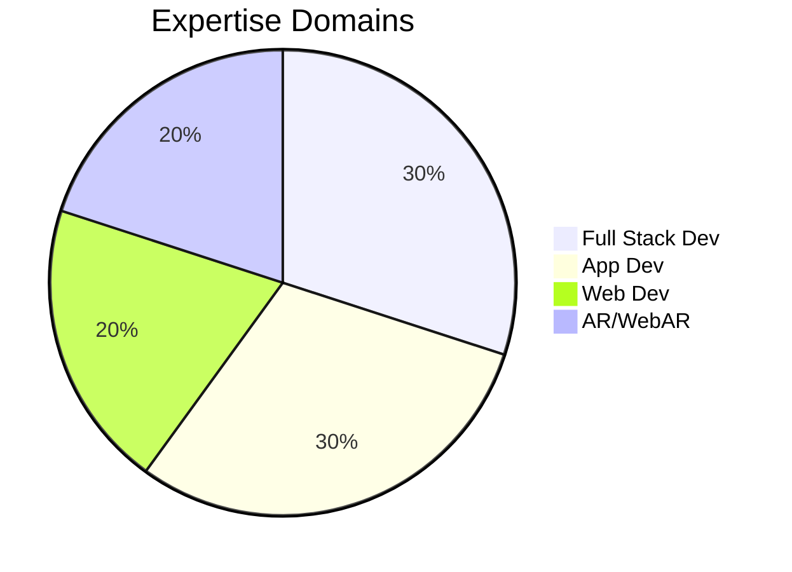

<!-- Profile banner -->

  

---

### 🚀 About Me

Hey there! I'm **Aswin** from **Chennai**, currently in my **final year** at  
🎓 **Rajalakshmi Institute of Technology**, pursuing **Computer Science & Engineering (AI & ML)**.

I’m currently working as a **CSPM Engineer Intern** at [**Securin**](https://securin.io/), where I’m exploring the intersection of **cloud security** and **automation**.

Over the past few years, I’ve completed **5 exciting internships**, gaining hands-on experience across a wide range of technologies:

-  **Magicbox Animations Pvt Ltd**  
-  **EOT Technologies**  
-  **IIT-AIIC**  
-  **AM Jain College**  
-  **Impensus Electronics Pvt Ltd**

---

💡 My technical interests and areas of expertise include:

- ⚙️ **Full Stack Development** – Building scalable, performant web & mobile apps  
- 📱 **App Development** – Cross-platform experiences with Flutter & native tools  
- 🌐 **Web Development** – Modern UI/UX, RESTful APIs, cloud deployment  
- 🪄 **Augmented Reality & WebAR** – Creating immersive, interactive experiences  

I'm passionate about **learning by building**, and I love turning ideas into reality with tech.

---

### 🛠️ Tech Stack & Tools

**Languages & Frameworks:**

**Cloud & DevOps:**

**Databases:**

---

### 🔥 Highlight Projects

#### 🧱 Full Stack:

[GPS Toll Based Simulation Using Python](https://github.com/Aswinraj040/GPS_TOLL_BASED_SIMULATION_PYTHON) – (Flask, MySQL, Plotly , Python)

#### 📱 App Development:

[Password Manager](https://github.com/Aswinraj040/PasswordManager) – (Kotlin, JetPack Compose)

[Auto Reply Drive](https://github.com/Aswinraj040/AutoReplyDrive) - (Kotlin , XML)

#### 🌐 Backend Development:

[GmailTasker](https://github.com/Aswinraj040/GMail_Automation_Project) – (Python, MySQL)

#### 🪄 Augmented Reality:

[AR Engine Explorer](https://github.com/Aswinraj040/Ar_App) – (Unity + AR Foundation + C#)

#### 🌍 Web AR:

[Image tracking using WebAR](https://github.com/Aswinraj040/WebARProject) – (HTML + Ar.js)

---

### 📊 GitHub Stats

  
  

---

### 💬 Contact Me

  
📧 **Mail:** [aswinraj040@gmail.com](mailto:aswinraj040@gmail.com)

---

### 🎯 Hobbies & Fun

- 🏸 Playing badminton & chess  
- 🚗 Driving and exploring  
- 🔧 Modifying and fixing electronic devices

---

  

  

