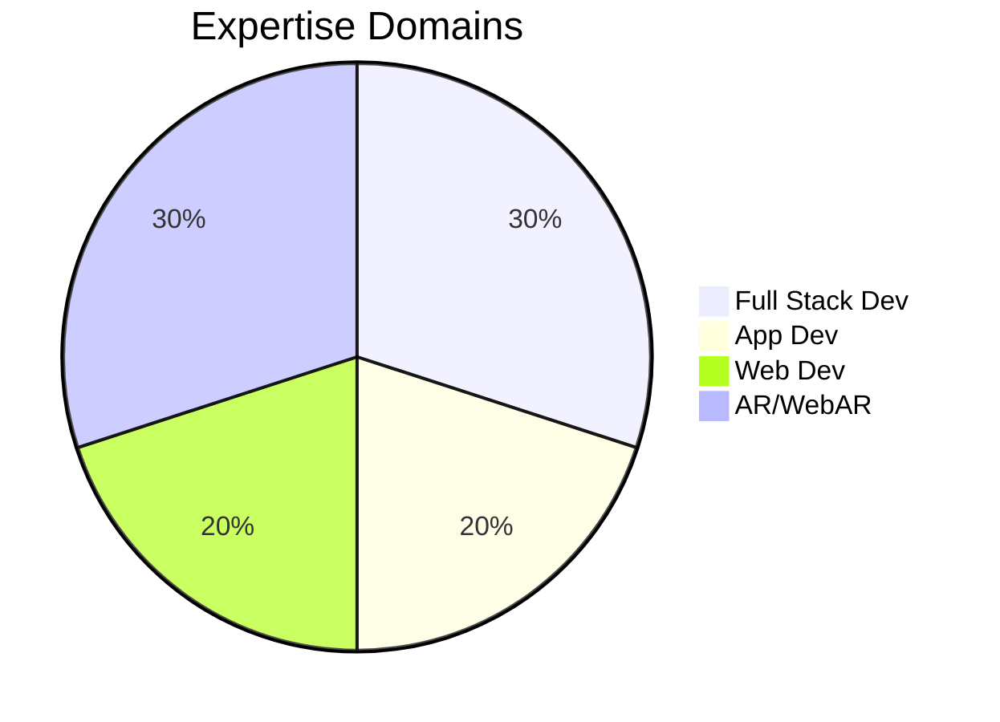

<!-- Profile banner -->

  

---

### 🚀 About Me

🎓 **Currently working as a CSPM Engineer Intern @ [Securin](https://securin.io/)**  
🔁 Completed **5 internships** at leading organizations:  
&nbsp;&nbsp;&nbsp;&nbsp;🎨 Magicbox Animations Pvt Ltd  
&nbsp;&nbsp;&nbsp;&nbsp;💻 EOT Technologies  
&nbsp;&nbsp;&nbsp;&nbsp;🏫 IIT-AIIC  
&nbsp;&nbsp;&nbsp;&nbsp;🏛️ AM Jain College  
&nbsp;&nbsp;&nbsp;&nbsp;⚡ Impensus Electronics Pvt Ltd  

💡 I specialize in:
- ⚙️ **Full Stack Development**
- 📱 **App Development**
- 🌐 **Web Development**
- 🪄 **Augmented Reality & Web AR**

🧠 Always learning, building, and pushing the limits of tech.

---

### 🛠️ Tech Stack & Tools

**Languages & Frameworks:**

**Cloud & DevOps:**

**Databases:**

---

### 🔥 Highlight Projects

#### 🧱 Full Stack:

🚀 [Smart Inventory System](#) – (Flask, MySQL, AWS Lambda)

#### 📱 App Development:

📱 [Expense Tracker App](#) – (Flutter, Dart, Firebase)

#### 🌐 Web Development:

🛒 [E-Commerce Platform](#) – (React, Node.js, MongoDB)

#### 🪄 Augmented Reality:

🧠 [Interactive AR Museum Guide](#) – (Unity + AR Foundation + C#)

#### 🌍 Web AR:

🎯 [Try-on Glasses in Browser](#) – (8thWall + Three.js)

> 💡 *Links are placeholders – plug in your best project URLs!*

---

### 📊 GitHub Stats

  
  

---

### 💬 Contact Me

  
📧 **Mail:** [yourmail@example.com](mailto:yourmail@example.com)

---

### 🎯 Hobbies & Fun

- 🏸 Playing badminton & chess  
- 🚗 Driving and exploring  
- 🔧 Modifying & repairing electronic gadgets  

---

  

  

